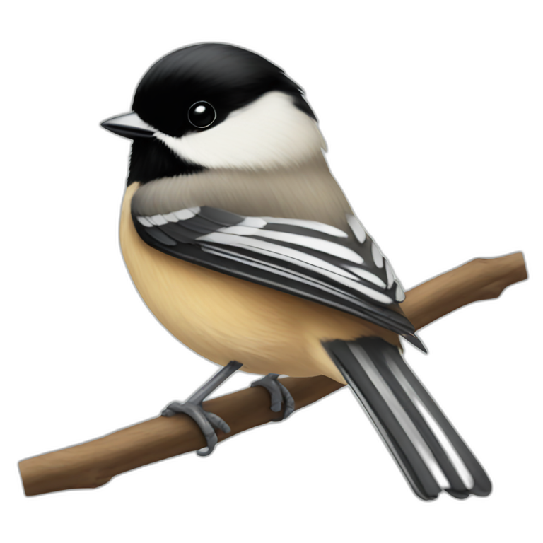

# chickadee 

A web app to view recent bird observations using [eBird](https://ebird.org/home) API data.

*chickadees are known for having exceptional memories. they have an incredible ability to remember where they've cached food in their environment. studies have shown that they can remember the locations of thousands of caches for months.*

## ⚙️ setup instructions

- download [node.js](https://nodejs.org/)
- download [neltify-cli](https://docs.netlify.com/cli/get-started/)
- create an [eBird account](https://ebird.org/home) and access your eBird API Key, create a `.env` file and assign your key to `VITE_EBIRD_API_KEY`
- `npm i`
- `netlify dev` to run app using netlify functions

## 🧑‍💻 functionality
- filter bird observations by region in the US
- filter by specific species (either US-wide or by region/sub-region)
- search 'notable' observations (which eBird defines as birds rarely spotted or birds in unusual locations)
- click on a bird to view its picture (sourced from Wikipedia) and a link to its Wikipedia page
- more features coming soon!

## 💻 tech stack
- Node.js
- JavaScript
- React
- Netlify/Netlify Functions
- [eBird API](https://documenter.getpostman.com/view/664302/S1ENwy59)
- [MediaWiki API](https://www.mediawiki.org/wiki/API:Main_page)

## 🚀 deployed app

View chickadee on [Netlify](https://chickadeeapp.netlify.app/)!

### 📸 app screenshots

#### landing page

#### view recent bird observations

#### filter observations by region

#### filter observations by species

#### view "notable" observations

#### view observation with image

